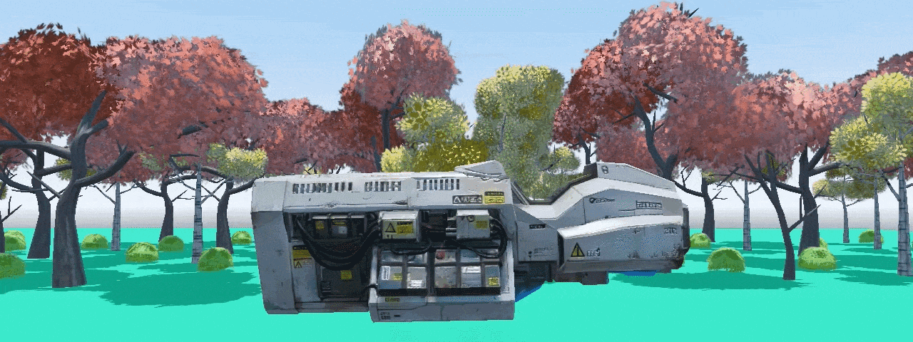
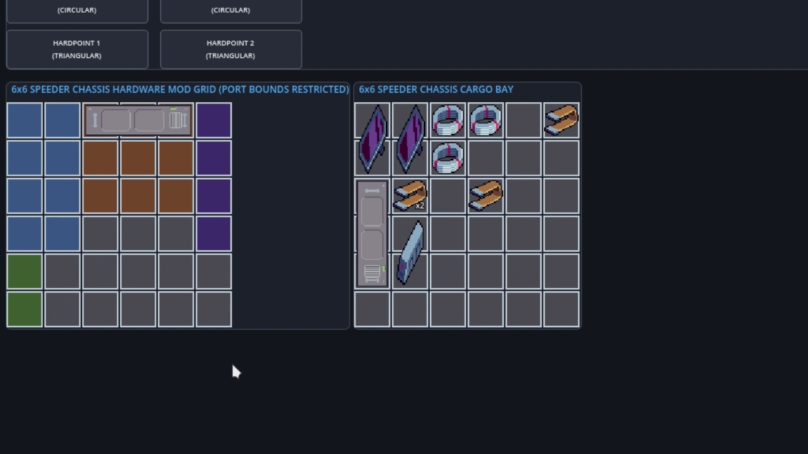
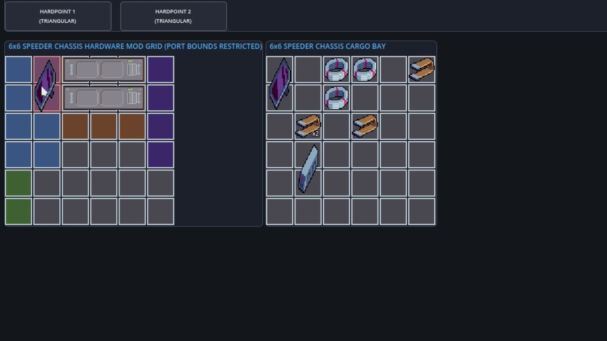
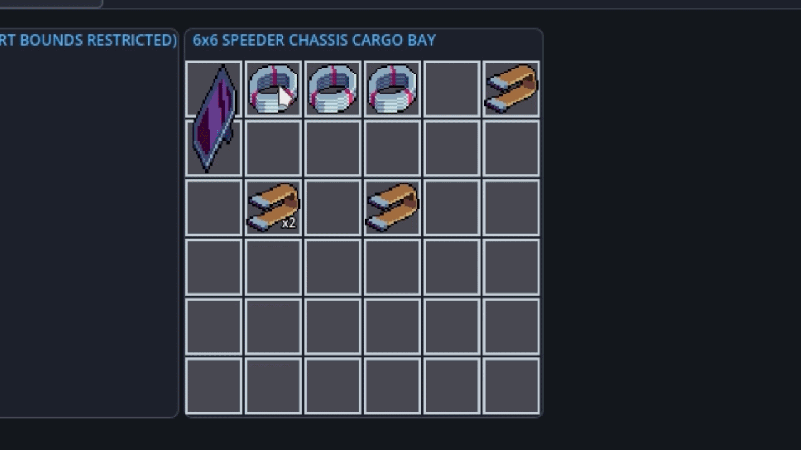
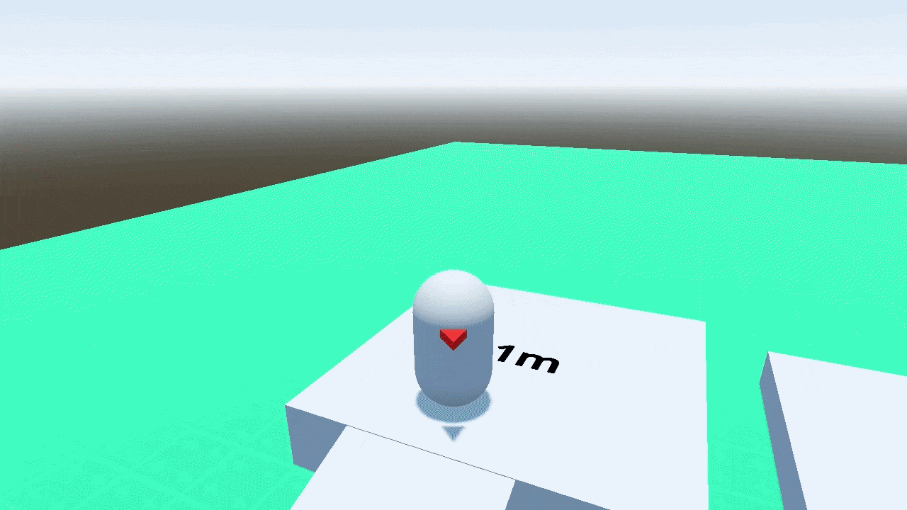

# Technical Portfolio: Game Developer



Hi. I am a Gameplay & UI Systems Developer specializing in **Godot 4**. 

My current main project is **Graveyard Shift**, a commercial narrative simulation and atmospheric management game. Since the full source code is private, this repository serves as a technical showcase of my work. It highlights my system architecture, coding standards, and ability to solve complex gameplay and UI challenges.

**Core Competencies:**
* Engine: Godot 4 (GDScript)
* Architecture: Component-based design, State-Machines, Data-Driven UI
* Focus: Clean code, memory/performance optimization, modular systems

---

## 1. System Architecture & Problem Solving

This is breakdown of complex systems I designed and implemented from scratch, demonstrating my structural logic and approach to game development.

### 1.1. Dual-Grid Spatial Inventory & Dynamic Sockets

**The Challenge:** Implement a classic Tetris-style spatial inventory for loose resources, integrated with a structured engine bay (Mod Grid) for vehicle upgrades. Modules vary in shape (1x3, 2x2) and must be restricted to specific logical chassis zones.

**My Approach:** I completely decoupled the grid math from the UI by handling logic inside custom serializable `Resource` scripts. Chassis zoning is mathematically enforced using 2D bounding box checks (`Rect2i`). 
To handle dynamic expansion, equipping a "Sidecar" module into a vehicle hardpoint programmatically instantiates a new `InventoryGrid` resource. I also wrote a safety-net routine for unequipping: it automatically transfers any items stored in the sidecar to the player's home stash to prevent data/loot loss.




<br><br>



<br><br>




### 1.2. Input Handoff & Actor Controller

**The Challenge:** Build a seamless system to transition control and camera tracking between an on-foot player character and a physics-based vehicle, avoiding input conflicts and saving CPU cycles on inactive actors.

**My Approach:** I used a State Coordinator pattern rather than hardcoding inputs into character scripts. Raw inputs are delegated to modular `InputPackage` child components. 
I built a global `PuppetManager` to handle authority handshakes: it disables the previous actor's package (`PROCESS_MODE_DISABLED`) and enables the new target. This entirely halts physics and input polling for inactive entities, optimizing performance.



### 1.3. Stateless Economy & Transaction Validation

**The Challenge:** Unify transaction logic across various game vendors (shops, scrap recycling, bartering) and implement a debt system where negative balances trigger gameplay consequences instead of a "Game Over".

**My Approach:**
I built a stateless central coordinator (`EconomyManager` autoload). State data (inventory/credits) is strictly isolated from the transaction math. Before any deal executes, manager runs a validation on cloned resource structures to guarantee spatial requirements are met. 
To handle debt, if a contract fine exceeds the current credit balance, I implemented a routine that dynamically converts the financial shortfall into gameplay Reputation penalties.

---

## 2. Code Previews

The following sections contain brief syntax overviews of the implemented managers. The isolated preview files are structured in the `src/` directory.

### A. Control Handoff: `PuppetManagerPreview.gd`
Handles input authority switching and process state handshakes between playable actors.

```gdscript
func set_active_puppet(puppet: Node) -> void:
	if active_puppet == puppet:
		return

	if active_puppet:
		_set_input_package_state(active_puppet, false)

	active_puppet = puppet
	_set_input_package_state(active_puppet, true)

	puppet_changed.emit(active_puppet)
```
👉 **[View Full File Preview](src/PuppetManagerPreview.gd)**

### B. Grid Math: `InventoryGridPreview.gd`
Handles 2D matrix checks, boundary checking, overlaps, and cell locking.

```gdscript
func can_place_item(item: InventoryItem, cell: Vector2i) -> bool:
	if locked: return false
	var w = item.get_width()
	var h = item.get_height()
	
	if cell.x < 0 or cell.y < 0 or cell.x + w > width or cell.y + h > height:
		return false
		
	# (Zoning and overlap iteration logic handled inside the file)
	return true
```
👉 **[View Full File Preview](src/InventoryGridPreview.gd)**

### C. Stats Mediator: `VectorStatsManagerPreview.gd`
Aggregates stat modifiers from modules and handles sub-grid generation/cleanup dynamically.

```gdscript
func remove_sidecar_grid(key: String) -> void:
	if sidecar_grids.has(key):
		var grid = sidecar_grids[key]
		var items_to_move = grid.get_all_items().duplicate()
		for item in items_to_move:
			PlayerState.home_stash_grid.auto_place(item.id, item.stack_size)
			grid.remove_item(item)
		sidecar_grids.erase(key)
		sidecar_grid_removed.emit(key)
```
👉 **[View Full File Preview](src/VectorStatsManagerPreview.gd)**

### D. Economy Autoload: `EconomyManagerPreview.gd`
Manages validation, transaction processing, and debt fallback logic.

```gdscript
func apply_fine(amount: int) -> void:
	if amount <= 0: return
	var shortfall = PlayerState.remove_credits(amount)
	if shortfall > 0:
		var trust_penalty = max(1, int(shortfall / 10.0))
		var res_penalty = max(1, int(shortfall / 10.0))
		PlayerState.remove_trust(trust_penalty)
		PlayerState.remove_resonance(res_penalty)
```
👉 **[View Full File Preview](src/EconomyManagerPreview.gd)**
